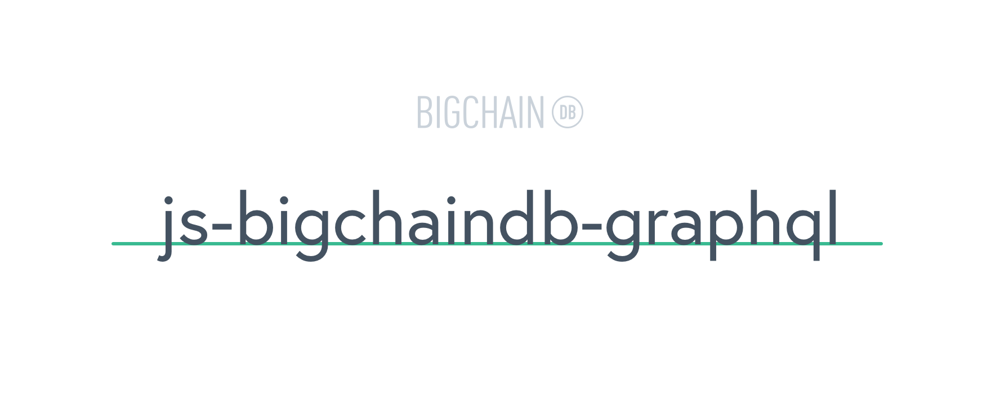

# [](https://www.bigchaindb.com)

> Example GraphQL API running on top of the BigchainDB JavaScript driver.

[](https://www.npmjs.com/package/bigchaindb-graphql)
[](https://travis-ci.org/bigchaindb/js-bigchaindb-graphql)
[](https://github.com/ascribe/javascript)
[](https://greenkeeper.io/)

## Table of Contents

- [Setup](#setup)
- [Usage](#usage)
- [Examples](#examples)
    - [Query a transaction](#query-a-transaction)
    - [Query multiple transactions by `asset_id`](#query-multiple-transactions-by-asset_id)
    - [Query only transfer transactions with `asset_id`](#query-only-transfer-transactions-with-asset_id)
    - [Query the blocks and votes for a transaction](#query-the-blocks-and-votes-for-a-transaction)
    - [Query the outputs endpoint by public key](#query-the-outputs-endpoint-by-public-key)
    - [Query the outputs endpoint by public key](#query-the-outputs-endpoint-by-public-key-1)
    - [Query a block and the associated votes](#query-a-block-and-the-associated-votes)
    - [Query the votes for a specific block](#query-the-votes-for-a-specific-block)
    - [Text-search on transactions that matches the asset fields/values](#text-search-on-transactions-that-matches-the-asset-fieldsvalues)
- [npm releases](#npm-releases)
- [License](#license)

## Setup

```bash
$ npm install bigchaindb-graphql
```

or

```bash
$ yarn add bigchaindb-graphql
```

(Optional) Prepopulate BigchainDB with the example transactions, see [bigchaindb/graphql-bigchaindb](https://github.com/bigchaindb/graphql-bigchaindb):

```bash
$ python prepopulate.py
```
These are the transactions used in the examples below.

```bash
$ npm run test
```

## Usage

The code does not talk to the backend database directly. It just retrieves whatever data it needs using the JavaScript driver and constructs the GraphQL objects from the returned JSON.

```javascript
import { graphql } from 'graphql'
import {
    BigchainDBGraphQLConnection,
    BigchainDBGraphQLSchema
} from 'bigchaindb-graphql'

const BigchainDBSchema = new BigchainDBGraphQLSchema(
    new BigchainDBGraphQLConnection("<connection details eg. 'http://localhost:9984/api/v1/', headers>")
).schema

const queryTransaction = `
{
    transaction(id: "3b3fd7128580280052595b9bcda98895a851793cba77402ca4de0963be958c9e") {
        id
        operation
        asset
        metadata
    }
}
`

graphql(BigchainDBSchema, queryTransaction).then(result => {
    console.log(JSON.stringify(result, null, 2))
})
```

## Examples

After prepopulating BigchainDB with the transactions provided you can run the following queries in the browser or Node.js.

### Query a transaction

```graphql
query {
    transaction(id:"3b3fd7128580280052595b9bcda98895a851793cba77402ca4de0963be958c9e") {
        id
        operation
        asset
        # we don't care about the inputs
        # inputs

        # from the outputs we don't care about the condition so we only want
        # the amount and public keys
        outputs {
            amount
            public_keys
        }

        # we don't care about the metadata
        # metadata
    }
}
```

### Query multiple transactions by `asset_id`

```graphql
query {
    transactions(asset_id:"3b3fd7128580280052595b9bcda98895a851793cba77402ca4de0963be958c9e") {
        # For each transaction returned I only want the id, operation and
        # public keys in the outputs
        id
        operation
        outputs {
            public_keys
        }
    }
}
```

### Query only transfer transactions with `asset_id`

```graphql
query {
    transactions(asset_id:"3b3fd7128580280052595b9bcda98895a851793cba77402ca4de0963be958c9e", operation:"TRANSFER") {
        # I only want the public keys and amounts of all the outputs that this
        # transfer transaction fulfills
        inputs {
            fulfills {
                output_index
                # the `transaction_id` inside fulfills is resolved to the
                # actual transaction so we can query fields on the transaction
                # pointed to in this inputs, notice that this can go as deep as you like
                transaction {
                    outputs {
                        amount
                        public_keys
                    }
                }
            }
        }
    }
}
```

### Query the blocks and votes for a transaction

```graphql
query {
    transaction(id:"3b3fd7128580280052595b9bcda98895a851793cba77402ca4de0963be958c9e") {
        # I want to know the blocks, votes and respective timestamps of a transaction
        asset
        metadata
        blocks {
            block {
                node_pubkey
                timestamp
            }
            votes {
                node_pubkey
                vote {
                    timestamp
                }
            }
        }
    }
}
```

### Query the outputs endpoint by public key

```graphql
query {
    outputs(publicKey:"FxEfUt9ArymGeCB99dZtfCUcsKwC29c8AHZ9EPnVWcyL") {
        output_index
        # once again the transaction_id is resolved to the actual transaction
        transaction {
           id
           operation
           asset
        }
    }
}
```

### Query the outputs endpoint by public key

```graphql
query {
    outputs(publicKey:"FxEfUt9ArymGeCB99dZtfCUcsKwC29c8AHZ9EPnVWcyL") {
        output_index
        # once again the transaction_id is resolved to the actual transaction
        transaction {
           id
           operation
           asset
        }
    }
}
```

### Query a block and the associated votes

```graphql
query {
    block(id: "c44c06985175ee0cf210fff65c44e63aa06300999e5e7654e13678582522e8f0") {
        id
        block {
            timestamp
            transactions {
                id
            }
            node_pubkey
            voters
        }
        votes {
            vote {
                timestamp
            }
        }
        signature
    }
}
```

### Query the votes for a specific block

```graphql
query {
    votes(block_id: "c44c06985175ee0cf210fff65c44e63aa06300999e5e7654e13678582522e8f0") {
        node_pubkey
        signature
        vote {
            voting_for_block
            previous_block
            is_block_valid
            invalid_reason
            timestamp
        }
    }
}
```

### Text-search on transactions that matches the asset fields/values

```graphql
query {
    search(text: "b") {
        id
        asset
    }
}
```

### Create a new transaction
> note: graphql doesn't support unstructured objects, hence the `asset` and `metadata` need to be serialized in an URI encoded string (e.g. `encodeURIComponent(JSON.stringify({ metadata: 'metavalue' }))`)

```graphql
mutation {
    transaction(
        publicKey: "4AzdUiGGjUNmSp75dNGe5Qw36czV8PdaLDkCY2bdZpcH",
        privateKey: "57c3KBq7hiQ7JLHuVWzBGfwCKeLfm1oFbv9CgP2uxwhN",
        asset: "{ assetdata: 'assetvalue' }",
        metadata: "{ metadata: 'metavalue' }"
    ) {
        id
        operation
        asset
        metadata
        inputs {
            owners_before
            fulfillment
            fulfills {
                output_index
                transaction {
                    id
                    asset
                    metadata
                    inputs {
                        fulfills {
                            transaction {
                                id
                            }
                        }
                    }
                }
            }
        }
        outputs {
            condition
            public_keys
            amount
        }
        blocks {
            block {
                node_pubkey
                timestamp
            }
            votes {
                node_pubkey
                vote {
                    timestamp
                }
            }
        }
    }
}
```

### Transfer transaction different public key
> note: graphql doesn't support unstructured objects, hence the `tx` and `metadata` need to be serialized in an URI encoded string (e.g. `encodeURIComponent(JSON.stringify(tx))`)
```graphql
mutation {
    transfer(
        tx: <transaction to transfer>,
        fromPublicKey: "8bpyjMowghbfN8vMTAyueQVggjtR9geACU8JeXLQHawY",
        fromPrivateKey: "DQGfjg1kseHZTedxsUjwTXukGZ8hPNjioJ7Btq9wyiTW",
        toPublicKey: "GvjRh229J3GEgGnSjKzdv81eiEUtjyftBsJzU2Urmfud",
        metadata: "{metadata: 'newmetavalue'}"
    ) {
        id
        operation
        asset
        metadata
        inputs {
            owners_before
            fulfillment
            fulfills {
                output_index
                transaction {
                    id
                    asset
                    metadata
                    inputs {
                        fulfills {
                            transaction {
                                id
                            }
                        }
                    }
                }
            }
        }
        outputs {
            condition
            public_keys
            amount
        }
        blocks {
            block {
                node_pubkey
                timestamp
            }
            votes {
                node_pubkey
                vote {
                    timestamp
                }
            }
        }
    }
}
```

## npm releases

For a new **patch release**, execute on the machine where you're logged into your npm account:

```bash
npm run release
```

Command is powered by [`release-it`](https://github.com/webpro/release-it) package, defined in the `package.json`.

That's what the command does without any user interaction:

- create release commit by updating version in `package.json`
- create tag for that release commit
- push commit & tag
- create a new release on GitHub, with change log auto-generated from commit messages
- publish to npm as a new release

If you want to create a **minor** or **major release**, use these commands:

```bash
npm run release-minor
```

```bash
npm run release-major
```

## License

```
Copyright 2017 BigchainDB GmbH

Licensed under the Apache License, Version 2.0 (the "License");
you may not use this file except in compliance with the License.
You may obtain a copy of the License at

   http://www.apache.org/licenses/LICENSE-2.0

Unless required by applicable law or agreed to in writing, software
distributed under the License is distributed on an "AS IS" BASIS,
WITHOUT WARRANTIES OR CONDITIONS OF ANY KIND, either express or implied.
See the License for the specific language governing permissions and
limitations under the License.
```
